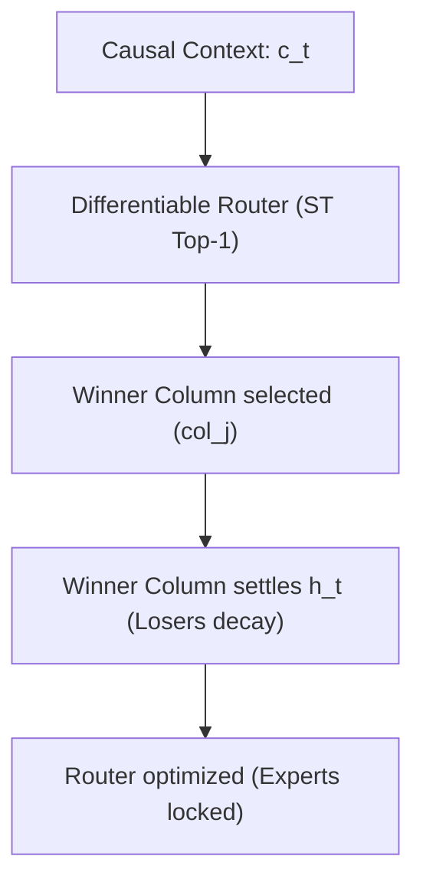

# SPARC & Raw AGNIS: End-to-End Research Checkpoint & Progress Guide

This document captures the complete chronological research trajectory, architectural milestones, and mathematical specifications of the **Raw AGNIS (Agnostic Gated Neuroplastic Integration System)** project and its successor, **SPARC (Sparse Predictive Adversarial/Associative Recurrent Columns)**.

---

## 1. Project Philosophy & Origin
The core objective of the **Raw AGNIS** project is to construct a continual sequence learning model utilizing **predictive coding** and biologically plausible learning rules (Hebbian update rules, lateral inhibitions, and dynamic cell growth) **without backpropagation** (no PyTorch autograd gradients for representation learning). 

The project has transitioned through several phases, diagnosing core bottlenecks at each stage, culminating in the **SPARC** modular column architecture.

---

## 2. Chronological Phase History

### Phase 1 — Associative Learning & Sparsity
* **Objective:** Verify that Hebbian plastic updates could learn static associative patterns.
* **Architecture:** Implemented recognition weights ($E$, mapping inputs to latents) and generative decoders ($D$, mapping latents to reconstructions). Settling iteratively inferred sparse activations ($z_t$) using lateral inhibitions.
* **Key Finding:** $k$-Winners-Take-All ($k$-WTA) sparsity created orthogonal representation codes, resolving overlap interference and stabilizing memory retention on associative pairs.

### Phase 2 — Sequential Learning (Seq AGNIS)
* **Objective:** Map context-dependent character transitions.
* **Architecture:** Introduced a recurrent transition matrix ($R$, updating transitions between past and current latents: $\Delta R = \eta_R z_t z_{prev}^T$), a high-error `FastMemory` episodic store, and offline consolidation sleep phases to replay memories and stabilize weights.
* **Key Finding:** Validated on doublet sequences ($A \to B \to C$ vs. $D \to B \to E$) and palindromes, Seq AGNIS tracked context-dependent sequences while minimizing forgetting relative to backpropagation controls.

### Phase 3 — Autonomous Neurogenesis
* **Objective:** Resolve fixed latent capacity limits by growing new hidden units dynamically.
* **Architecture:** Created a growth controller triggered by prediction error L2 norms, dynamic matrix expansion (`grow_units`), maturity gating to suppress newborn activations during settling, and homeostatic pruning (`prune_units`) to delete redundant units.
* **Key Finding:** Spawning new units dynamically resolved capacity bottlenecks, enabling the model to learn new tasks while pruning kept the latent dimension compact and bounded.

### Phase 4 — Character-Level Continual Language
* **Objective:** Evaluate AGNIS under streaming text sequences across 4 domain shifts (Prose, Code, Arithmetic, Dialogue) using a shared vocabulary.
* **Architecture:** Developed zero-leakage evaluation guards: `predict_no_state_update(x)` and `advance_state_only(x, y)` to step hidden states without mutating weights.
* **Key Finding:** Naive RNNs suffered from massive forgetting (BPC forgetting up to 3.7), while neurogenesis reduced forgetting to near-zero (0.019) by dynamically allocating isolated sub-networks to insulate older tasks.

### Phase 5 — TinyStories Mini (Conditional Generation)
* **Objective:** Next-character prompt-conditioned story continuation.
* **Architecture:** Developed semantic story template generators (animals, objects, emotions, actions). Implemented greedy and stochastic temperature top-$k$ decoding alongside a latent fatigue trace to break repeating limit cycles.
* **Key Finding:** Latent fatigue traces and sampling decoded diverse, grammatical text, reducing repetition rates from **99.2%** to **53.0%** (matching GRU baselines) and establishing a 13x forgetting reduction over fixed-capacity models.

### Phase 6 — Deep Hierarchical PC (Deep AGNIS)
* **Objective:** Stack layers to build abstract hierarchical representations.
* **Architecture:** Built a stacked 3-layer hierarchy where prediction residuals propagate bottom-up, and generative predictions flow top-down.
* **Key Finding (The Monolithic Collapse):** Multi-layer monolithic AGNIS stacks collapsed entirely to the **4.0% random guessing floor** across all seeds. Analysis showed that in a single shared latent space, Hebbian recurrent updates ($R$) overwritten each other across domains, causing complete representation rank collapse.

---

## 3. The Transition to SPARC (v0.2 Spec)

To address monolithic representation collapse, we designed **SPARC**: a modular bank of isolated columns with input-driven routing.



### SPARC Phase 1A: Oracle & Nonparametric Routing
* **Goal:** Verify that isolating columns prevents interference.
* **Implementations:** Implemented oracle routing (`sparc_task_id_oracle`) and nonparametric centroid routing (`sparc_nearest_prototype`).
* **Empirical Validation:** Broken the 4% collapse floor! SPARC achieved **`45.2%` peak accuracy** and **`37.8%` final accuracy** with forgetting restricted to **`7.3%–7.5%`** (a 70% forgetting reduction over recurrent baselines).

### SPARC Phase 1B: Differentiable Learned Routing [Current]
* **Goal:** Build a task-ID-free learned router that routes to specialized columns at inference.
* **Core Specifications (v0.2 Spec):**
  1. **Synaptic Isolation:** Columns and heads are frozen (`requires_grad = False` / `eval()`). Only the router's projection parameters ($W_r$) are optimized.
  2. **External Causal Context & smoothed logits:** Causal context vectors $c_t = \gamma_c c_{t-1} + (1 - \gamma_c) z_t$ and logit inertia are maintained externally to prevent batch leakage.
  3. **Domain-Aware Load Balancing:** Load-balancing KL divergence $D_{KL}(p_{\text{target}} \parallel \bar{r})$ matches expected domain proportions in the batch.
  4. **Median/MAD Energy Calibration:** Normalizes column settling energies using robust Median and MAD statistics with scale floors computed on training data.
  5. **Cached Distillation:** Stores context vectors and raw teacher logits in a replay buffer to lock down past routing configurations.
  6. **Probabilistic mixtures (Router C):** Backpropagates task losses through soft predicted probability mixtures: $p(y_t \mid x_t) = \sum_j r_{t,j} p_j(y_t \mid x_t)$.
  7. **State-Safe evaluations:** Evaluates columns without modifying recurrent, usage, or growth states.

---

## 4. Current Repository Layout & Source Modules

* **[column.py](file:///c:/Users/Helios/Desktop/Neural-Networks-Raw/src/agnis/sparc/column.py):** Predictive column settled state inference, parameter updates, and consecutive-convergence early stopping.
* **[learned_router.py](file:///c:/Users/Helios/Desktop/Neural-Networks-Raw/src/agnis/sparc/learned_router.py):** Differentiable ST Top-1 routing logic and project projections.
* **[minimum_energy_router.py](file:///c:/Users/Helios/Desktop/Neural-Networks-Raw/src/agnis/sparc/minimum_energy_router.py):** State-safe evaluations and Median/MAD energy calibration.
* **[sparc_model.py](file:///c:/Users/Helios/Desktop/Neural-Networks-Raw/src/agnis/sparc/sparc_model.py):** Model wrapper coordinating the column bank, external context states, and mixture logsumexp log-probs.
* **[sequence_wrapper.py](file:///c:/Users/Helios/Desktop/Neural-Networks-Raw/src/agnis/sequence/sequence_wrapper.py):** Integrates router optimization steps, target proportions, distillation replays, and online calibration.
* **[test_sparc_routing.py](file:///c:/Users/Helios/Desktop/Neural-Networks-Raw/tests/test_sparc_routing.py):** Unit tests verifying routing, isolation, and state stability.

---

## 5. Verification Commands for the New Machine

### 1. Verification of the Unit Test Suite
To verify the entire test suite (144 passed tests) on your new machine:
```bash
PYTHONPATH=src:. pytest tests/
```

### 2. Launching the Multi-Seed Sweep on Kaggle
To run the full 5-seed comparative sweep for all 6 router models:
```python
!PYTHONPATH=src:. python experiments/phase6_deep_stack/run_deep_sweep.py \
    --models "sparc_task_id_oracle,sparc_nearest_prototype,sparc_minimum_energy,sparc_supervised_router,sparc_energy_distilled,sparc_learned_mixture" \
    --workers 4 \
    --seeds 5

!PYTHONPATH=src:. python experiments/phase6_deep_stack/summarize_phase6.py
!cat results/phase6/summary.md
```
